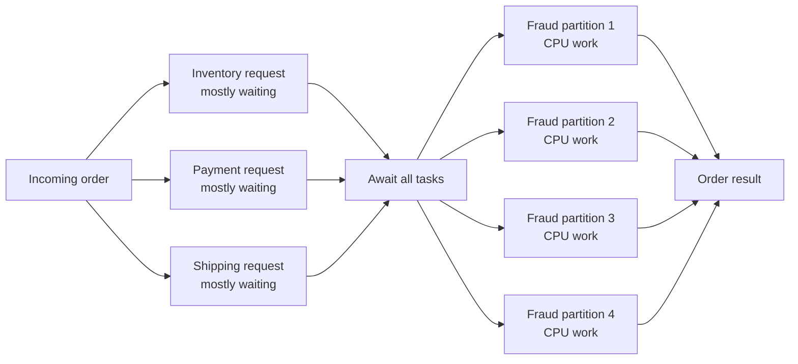

# One Order, Two Concurrency Models

> A small, runnable concurrency lab for C# and Java developers: task-based
> concurrency, multithreading, and cooperative cancellation—side by side.

[](https://github.com/karthikkasubhagit/concurrency-lab-csharp-java/actions/workflows/build.yml)

Imagine an order service that must:

1. wait for inventory, payment, and shipping services; and
2. calculate CPU-heavy fraud checks.

Those two workloads look concurrent, but they need different tools.

| Question | Task-based concurrency (“multitasking”) | Multithreading |
|---|---|---|
| Unit of work | A logical operation (`Task`, `CompletableFuture`, virtual thread) | An OS/platform thread |
| Best fit | Mostly waiting: HTTP, database, files, timers | CPU-heavy work that can run in parallel |
| Main benefit | High throughput without blocking a thread per wait | Lower latency by using multiple CPU cores |
| Means “a new thread”? | **No.** A task is not a thread. | **Yes.** Work executes on multiple threads |
| Typical mistake | Wrapping blocking work in `Task.Run` and calling it async | Adding threads to I/O work and paying context-switch costs |

“Multitasking” also has an operating-system meaning: running multiple processes
by time-slicing and parallel execution. In application code, developers often use
the word less precisely for running several logical tasks concurrently. This lab
uses **task-based concurrency** for that second meaning.

## The mental model



- The service calls overlap while they wait. In C#, `Task.Delay` does not hold a
  worker thread. In Java, virtual threads make blocking-style code cheap by
  unmounting from their carrier thread during supported blocking operations.
- The fraud calculation is split across platform/thread-pool threads so several
  CPU cores can work at the same time.
- Thread IDs in the output are evidence about *where* work ran; they are not the
  identity of a task.

## Run it

Prerequisites: [.NET 8 SDK](https://dotnet.microsoft.com/download/dotnet/8.0)
and [JDK 21](https://adoptium.net/temurin/releases/?version=21). Maven is not
required; both examples deliberately use only their standard libraries.

```bash
# Run both
./run-all.sh

# C# only
dotnet run --project csharp/ConcurrencyLab

# Java only
cd java
./run.sh
```

Each program supports `all`, `tasking`, `threading`, or `cancellation`:

```bash
dotnet run --project csharp/ConcurrencyLab -- cancellation
cd java && ./run.sh cancellation
```

Numbers and thread ordering vary by machine. That nondeterminism is part of the
lesson.

## Read the examples side by side

| Concept | C# | Java |
|---|---|---|
| Concurrent I/O-style tasks | [`TaskingDemo.cs`](csharp/ConcurrencyLab/TaskingDemo.cs) | [`TaskingDemo.java`](java/src/dev/karthik/concurrencylab/TaskingDemo.java) |
| Parallel CPU work | [`ThreadingDemo.cs`](csharp/ConcurrencyLab/ThreadingDemo.cs) | [`ThreadingDemo.java`](java/src/dev/karthik/concurrencylab/ThreadingDemo.java) |
| Cooperative cancellation | [`CancellationDemo.cs`](csharp/ConcurrencyLab/CancellationDemo.cs) | [`CancellationDemo.java`](java/src/dev/karthik/concurrencylab/CancellationDemo.java) |

### The important comparison

```csharp
// C#: starting tasks does not mean starting threads.
Task<Result>[] calls =
[
    CallServiceAsync("inventory", cancellationToken),
    CallServiceAsync("payment", cancellationToken),
    CallServiceAsync("shipping", cancellationToken)
];

Result[] results = await Task.WhenAll(calls);
```

```java
// Java 21: one virtual thread per task, but not one OS thread per task.
try (var executor = Executors.newVirtualThreadPerTaskExecutor()) {
    List<Future<Result>> calls = services.stream()
        .map(service -> executor.submit(() -> callService(service)))
        .toList();
}
```

Virtual threads are still `Thread` objects in Java, and an executor task runs
inside each one, but they are not permanently tied to OS threads. They make the
simple thread-per-request style scalable for waiting workloads; they do not make
CPU work faster.

## CancellationToken, without the mystery

A C# `CancellationToken` is:

- a **read-only view of a shared cancellation signal**;
- a way to request cancellation, not permission to kill a thread;
- cooperative—the called code must observe it;
- safe to pass through every layer that can cancel;
- expected to end with `OperationCanceledException`, which represents a
  cancelled outcome rather than an unexpected failure.

The owner creates and controls the `CancellationTokenSource`. Other methods
usually receive only its `.Token`:

```csharp
using var cts = new CancellationTokenSource(TimeSpan.FromMilliseconds(650));

try
{
    await ProcessOrderAsync(cts.Token);
}
catch (OperationCanceledException) when (cts.IsCancellationRequested)
{
    Console.WriteLine("The caller cancelled the operation.");
}
```

Passing a token does nothing by itself. The operation must pass it to APIs that
support cancellation, call `ThrowIfCancellationRequested()`, inspect
`IsCancellationRequested`, or register a callback. Cancellation is also not
rollback: any side effect completed before the signal remains completed unless
your business logic compensates for it.

### What is the Java equivalent?

Java has no exact built-in equivalent to .NET's token model.
`Future.cancel(true)` requests cancellation and interrupts the executing thread.
Blocking calls such as `Thread.sleep` respond to interruption, but CPU loops must
check `Thread.currentThread().isInterrupted()` themselves. It is the same core
idea: **request, observe, stop safely**.

| Confusion | Better model |
|---|---|
| “Cancellation kills the task.” | It asks cooperative code to stop. |
| “Passing the token is enough.” | Someone must observe it. |
| “Cancellation undoes earlier work.” | It stops future work; rollback is separate. |
| “Dispose cancels the source.” | Disposal releases resources; call `Cancel()` to signal. |
| “Java interrupt is an exception to swallow.” | Restore the interrupt or propagate cancellation. |

## Why not use more threads for everything?

For CPU-bound work, useful parallelism is limited roughly by available cores.
Beyond that, extra platform threads add scheduling and context-switch overhead.
For waiting work, async I/O or Java virtual threads let you express much more
concurrency without dedicating a platform thread to every wait.

The shortest rule worth remembering:

> Concurrency is about dealing with many things at once. Parallelism is about
> doing many things at the same instant.
